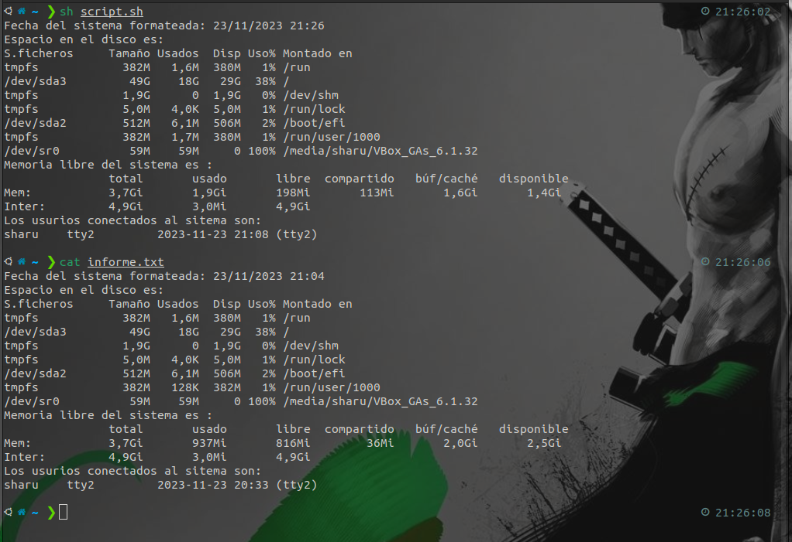

# Redirecionamiento
## Genera un archivo llamado informe.txt que contenga la siguiente información:
  * La fecha del sistema formateada. <!--date +'%d/%m/%Y %H:%M'-->
  * El espacio en disco.  <!--df -h-->
  * La memoria libre del sistema  <!--free -h-->
  * Usuarios conectados en el sistemas.  <!--who-->
  

# Respuestas:
---
Para hacer que el script guardara todos los datos en un archivo llamado informe.txt se podia hacer de dos maneras: 
* Que detras de cada linea de comando pusieramos `>informe.txt` en la primera `>>inform.txt` en la segunda y asi sucesivamente.
* Antes de ejecutar el sh script.sh añadirle al final el >informe.txt. y esto quedaria:
  `sh script.sh >informe.txt`
---

* Script
```
#!bin/bash <!--primera linea obligatoria-->
echo "Fecha del sistema formateada: $(date +'%d/%m/%Y %H:%M')" <!--comando para ver la fecha y la hora-->
echo "Espacio en el disco es:" 
(df -h) <!--comando para ver el espacio del disco-->
echo "Memoria libre del sistema es : "
(free -h) <!--comando para ver el espacio libre del disco-->
echo "Los usurios conectados al sitema son:"
(who) <!--comando para ver los usuarios conectados-->

```


* Resultado

